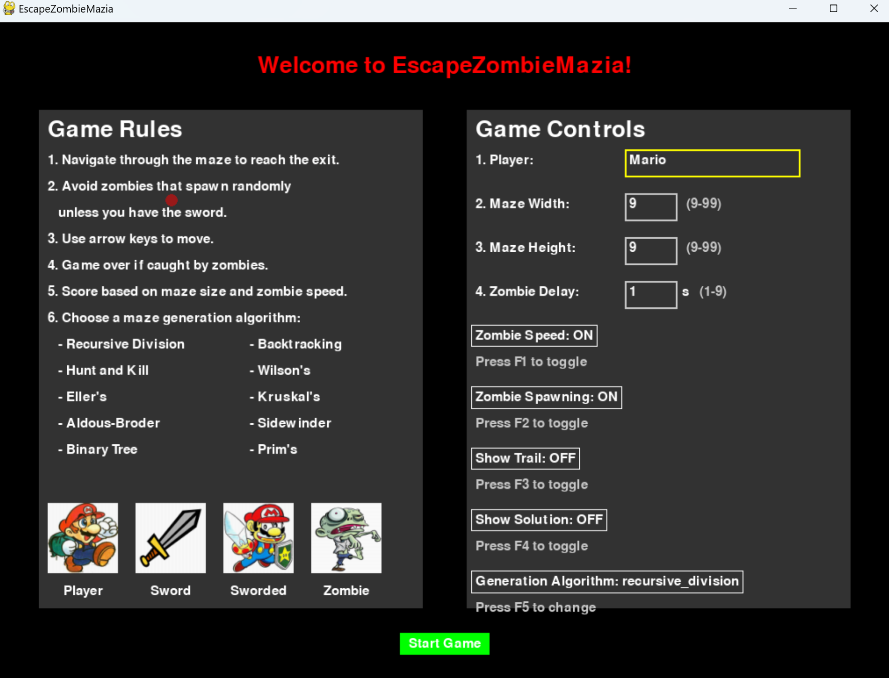
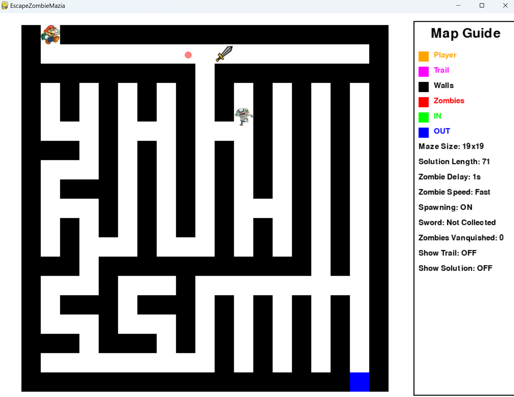

# EscapeZombieMazia





EscapeZombieMazia is a maze-based game where players navigate through procedurally generated mazes while avoiding zombies and collecting items.

## Game Features

- Multiple maze generation algorithms
- Zombie enemies that spawn and move randomly
- Collectible sword to defeat zombies
- Customizable game settings
- Leaderboard system

## Similar Games

EscapeZombieMazia shares similarities with various maze and dungeon-crawling games:

1. Pac-Man: While not exactly the same, it involves navigating a maze while avoiding enemies.

2. Maze Runner games: These often involve solving a maze with various obstacles or enemies.

3. Dungeon crawlers: Many roguelike games feature maze-like levels with enemies and items to collect.

4. Educational maze games: Used to teach problem-solving skills, often with simpler graphics.

5. 3D maze games: More immersive versions that put the player in a first-person perspective.

6. Procedurally generated maze games: Similar to this implementation, where mazes are created algorithmically.

7. Multiplayer maze games: Where players compete to solve mazes or catch each other.

EscapeZombieMazia combines elements from several of these, such as:
- Procedural maze generation
- Enemy avoidance (zombies)
- Item collection (sword)
- Multiple algorithms for maze creation

This combination makes the game unique while still being familiar to players who enjoy maze-based challenges. The addition of different maze generation algorithms as a selectable feature is particularly interesting and educational.

## Getting Started

Under development. For now, see INSTALL.md
Edit the emz.env to change difficulty and other parameters.

To get started with EscapeZombieMazia:

1. Ensure you have Python 3.x installed on your system.
2. Clone this repository:
   ```
   git clone https://github.com/yourusername/EscapeZombieMazia.git
   ```
3. Navigate to the project directory:
   ```
   cd EscapeZombieMazia
   ```
4. Install the required dependencies:
   ```
   pip install -r requirements.txt
   ```
5. Run the game:
   ```
   python ezm/ezm.py
   ```

## Contributing

We welcome contributions to EscapeZombieMazia! Here's how you can contribute:

1. Fork the repository on GitHub.
2. Create a new branch for your feature or bug fix.
3. Make your changes and commit them with clear, descriptive messages.
4. Push your changes to your fork.
5. Submit a pull request to the main repository.

Please ensure your code adheres to the project's coding standards and include tests for new features.

## License

EscapeZombieMazia is released under the MIT License. See the LICENSE file for more details.